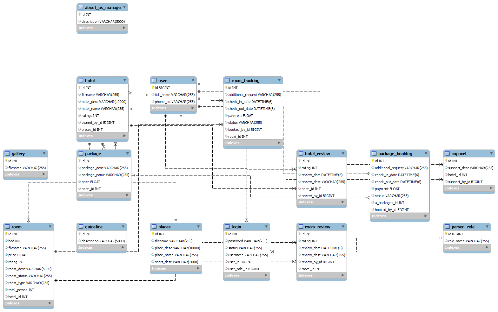

### E-R Diagram for the application



---
This is hotel booking and management system with three different roles: **User**, **Hotel Admin**, and **Super Admin**. The system includes room bookings, hotel management, user reviews, role-based access control (RBAC),JWT Authentication.
Users can explore **various travel destinations (places)**, view associated **hotels and room listings**, and **book rooms** in those hotels. After a stay, users can also **leave reviews** and **cancel bookings** if needed.

###  Current Features:

####  User
- **Authentication**: Register, login with JWT-based authentication.
- **Explore**: Browse different places, hotels, and available rooms.
- **Booking**: Book rooms in hotels and manage their bookings.
- **Review System**: Leave reviews only for hotels the user has booked.
- **Booking Cancellation**: Cancel their own bookings.

####  Hotel Admin

- **Hotel Management**: Edit hotel information, add new hotel packages.
- **Room Management**: Add new rooms with photos, manage room details.
- **Booking Management**: View all bookings, approve or cancel them.
- **Review Management**: View all reviews related to their hotels and rooms.

#### Super Admin

- **User & Admin Control**: View, manage, and delete any user or hotel admin.
- **Role Management**: Change roles of users (e.g., Change user role to hotel admin).
- **Booking Oversight**: View all bookings in the system.
- **Hotel Oversight**: Access detailed information about all hotels, rooms, and associated users.
- **Gallery Management**: Manage the photo gallery for different places.

---

## Steps to Setup:

**1. Clone the app**

```bash
git clone https://github.com/Meelanlama/GhumGham_Travels_backend.git
```
---

**2. Create MySQL database**

```bash
CREATE DATABASE travels;
```
**Change MySQL username and password as per your credentials**
**Download the sql file from /database and import it**

---

**3. Run the app using Maven**

- Run:

```bash
`./mvnw spring-boot:run`
```

- App will be accessible at: [http://localhost:8080](http://localhost:8080)

- For Swagger Api Docs: http://localhost:8080/swagger-ui/index.html#/

---
## Explore Rest APIs

### User Management

| Method | URL                          | Description                  |
| ------ | ---------------------------- | ---------------------------- |
| PUT    | `/user/status/{id}/{status}` | Change user account status   |
| PUT    | `/user/role`                 | Change user role             |
| POST   | `/user`                      | Register a new user          |
| POST   | `/user/update`               | Update user profile          |
| GET    | `/user/details`              | Get current user details     |
| GET    | `/user/{offset}/{page}`      | Get paginated list of users  |
| GET    | `/user/{id}`                 | Get user by ID               |
| GET    | `/user/logged/in`            | Get currently logged-in user |
| GET    | `/user/all`                  | Get all users                |

---
### Hotel Management

|Method|URL|Description|
|---|---|---|
|GET|`/hotel`|Get hotel of logged-in hotel admin|
|POST|`/hotel`|Create or update hotel info|
|GET|`/hotel/logged/user`|Get hotel for current user|
|GET|`/hotel/get/by/id/{id}`|Get hotel by ID|
|GET|`/hotel/all`|Get all hotels|
|DELETE|`/hotel/delete`|Delete a hotel|

---
###  Hotel Packages

| Method | URL               | Description                                      |
| ------ | ----------------- | ------------------------------------------------ |
| POST   | `/package`        | Add a new hotel package                          |
| GET    | `/package/hotel`  | Get packages of current hotel admin              |
| GET    | `/package/delete` | Delete a hotel package                           |

---
###  Hotel Reviews

|Method|URL|Description|
|---|---|---|
|POST|`/hotel/review`|Submit a hotel review|
|GET|`/hotel/review/by/hotel`|Get reviews for a hotel|
|DELETE|`/hotel/review/delete`|Delete a hotel review|

---
###  Package Booking

| Method | URL                              | Description                               |
| ------ | -------------------------------- | ----------------------------------------- |
| PUT    | `/package/booking/change/status` | Change package booking status             |
| POST   | `/package/booking`               | Book a package                            |
| GET    | `/package/booking/{id}`          | Get package booking by ID                 |
| GET    | `/package/booking/user`          | Get all package bookings for current user |
| GET    | `/package/booking/by/package`    | Get all bookings for a specific package   |
| GET    | `/package/booking/all`           | Get all package bookings                  |

---
### Room Management

| Method | URL                   | Description                          |
| ------ | --------------------- | ------------------------------------ |
| PUT    | `/room/change/status` | Change room status (active/inactive) |
| GET    | `/room`               | Get rooms of current hotel           |
| POST   | `/room`               | Add a new room to current hotel      |
| GET    | `/room/by/id/{id}`    | Get room details by ID               |
| GET    | `/room/all`           | Get all rooms                        |
| DELETE | `/room/delete`        | Delete a room                        |

---
###  Room Booking

| Method | URL                           | Description                                  |
| ------ | ----------------------------- | -------------------------------------------- |
| PUT    | `/room/booking/change/status` | Change room booking status (approve/cancel)  |
| POST   | `/room/booking`               | Book a room                                  |
| GET    | `/room/booking/{id}`          | Get booking details by ID                    |
| GET    | `/room/booking/user`          | Get all bookings of current user             |
| GET    | `/room/booking/user/both`     | Get current user's room and package bookings |
| GET    | `/room/booking/by/room`       | Get bookings for a specific room             |
| GET    | `/room/booking/all`           | Get all room bookings                        |

---
###  Room Reviews

| Method | URL                    | Description                     |
| ------ | ---------------------- | ------------------------------- |
| POST   | `/room/review`         | Submit a room review            |
| GET    | `/room/review/by/room` | Get reviews for a specific room |
| DELETE | `/room/review/delete`  | Delete a room review            |

---
### Places

|Method|URL|Description|
|---|---|---|
|GET|`/places`|Get all places|
|POST|`/places`|Add a new place|
|GET|`/places/id/{id}`|Get place details by ID|
|DELETE|`/places/delete`|Delete a place|

---
###  Security & Login

|Method|URL|Description|
|---|---|---|
|POST|`/login`|Authenticate and login|
|GET|`/login/loggedinuser`|Get details of logged-in user|
|GET|`/login/check`|Check if session is active|

---
### Photo Gallery

|Method|URL|Description|
|---|---|---|
|GET|`/gallery`|View gallery images|
|DELETE|`/gallery/delete`|Delete image from gallery|
